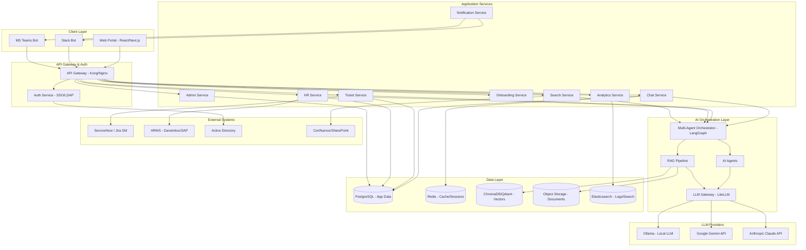
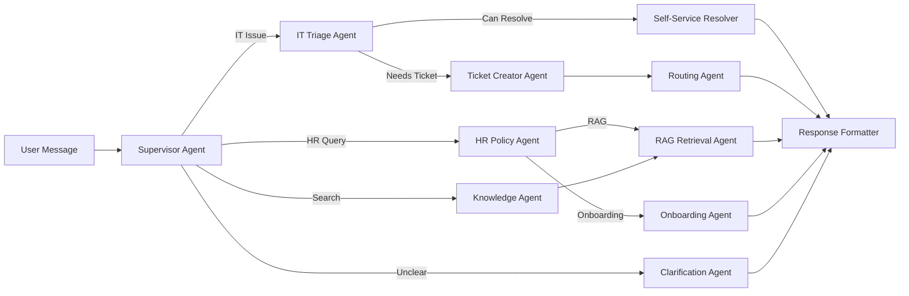
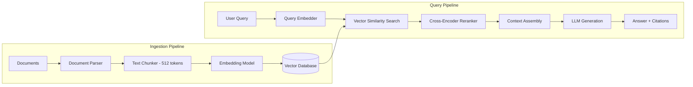
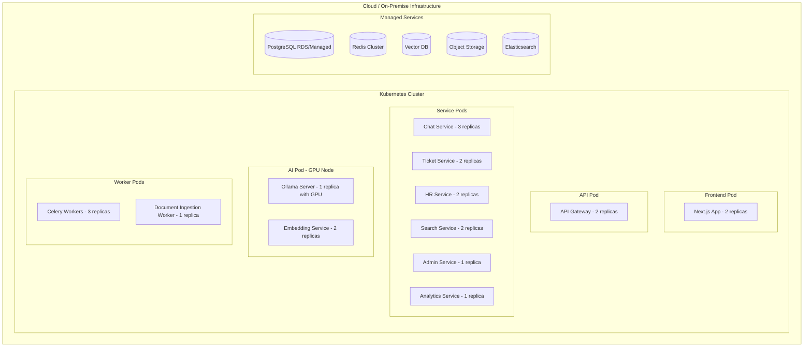

# Architecture Document

## Project: ImpetusAI Workplace Platform

**Version:** 1.0  
**Date:** March 12, 2026  
**Organization:** Impetus Technologies  

---

## 1. Architecture Overview

ImpetusAI follows a **modular microservices architecture** with a **multi-agent AI orchestration layer** at its core. The system is designed for horizontal scalability, security-first data handling, and seamless integration with enterprise systems.

### 1.1 Architecture Principles

| Principle | Description |
|-----------|-------------|
| **AI-First** | Every user interaction flows through AI agents before human escalation |
| **Modular** | Each module (AITSD, AIHRA, EKH) operates independently but shares core infrastructure |
| **Secure by Design** | PII redaction, encryption, and RBAC embedded at every layer |
| **API-First** | All services expose RESTful APIs; integrations via standard protocols |
| **Cloud-Native** | Containerized services, orchestrated via Kubernetes |
| **Fail-Safe** | Graceful degradation with fallback mechanisms for LLM unavailability |

---

## 2. High-Level Architecture



---

## 3. Component Architecture

### 3.1 Client Layer

#### 3.1.1 Web Portal
- **Technology:** React 18 / Next.js 14 with TypeScript
- **Styling:** Tailwind CSS + Shadcn/UI component library
- **State Management:** Zustand / React Query
- **Real-time:** WebSocket connection for live chat and notifications
- **Authentication:** OAuth 2.0 / SAML via SSO redirect

#### 3.1.2 Slack / Teams Bots
- **Slack:** Bolt.js framework, Events API subscription
- **Teams:** Microsoft Bot Framework SDK
- **Shared Logic:** Common NLU proxy → routes to same backend APIs

---

### 3.2 API Gateway & Auth

#### 3.2.1 API Gateway
- **Technology:** Kong Gateway (open-source) or Nginx with rate limiting
- **Features:**
  - Request routing and load balancing
  - Rate limiting (100 req/min per user)
  - Request/response logging
  - CORS management
  - API key and JWT validation

#### 3.2.2 Authentication Service
- **Technology:** Keycloak (open-source) or direct SAML/LDAP
- **Features:**
  - SSO integration with corporate Active Directory
  - JWT token issuance and validation
  - Role-based access control (RBAC)
  - Session management via Redis

---

### 3.3 Application Services (Microservices)

Each service is a containerized Python (FastAPI) application.

| Service | Responsibility | Key APIs |
|---------|---------------|----------|
| **Chat Service** | Manages chat sessions, message history, WebSocket connections | `POST /chat`, `GET /history`, `WS /ws/chat` |
| **Ticket Service** | CRUD for tickets, ITSM sync, SLA tracking | `POST /tickets`, `PATCH /tickets/{id}`, `GET /tickets` |
| **HR Service** | Policy Q&A, leave queries, document generation | `POST /hr/query`, `GET /hr/policies`, `POST /hr/documents` |
| **Onboarding Service** | Onboarding workflow, checklist management | `POST /onboarding`, `PATCH /onboarding/{id}/tasks` |
| **Search Service** | Semantic search, knowledge article management | `POST /search`, `GET /articles` |
| **Admin Service** | System configuration, user management, routing rules | `CRUD /admin/*` |
| **Analytics Service** | Usage analytics, ticket analytics, AI performance metrics | `GET /analytics/*` |
| **Notification Service** | Email, Slack, Teams notifications | `POST /notify` |

---

### 3.4 AI Orchestration Layer (Core)

This is the **heart of the system** — a multi-agent framework that coordinates specialized AI agents.

#### 3.4.1 Multi-Agent Orchestrator

- **Technology:** LangGraph (from LangChain ecosystem)
- **Pattern:** Supervisor agent delegates to specialized worker agents
- **State Machine:** Manages conversation state transitions



#### 3.4.2 Agent Definitions

| Agent | Role | Tools Available |
|-------|------|----------------|
| **Supervisor** | Intent classification, delegation to appropriate sub-agent | None (pure LLM reasoning) |
| **IT Triage Agent** | Classify IT issues, assess severity, determine resolution path | Ticket DB lookup, knowledge search |
| **Self-Service Resolver** | Attempt automated resolution for known issues | Runbook search, script executor |
| **Ticket Creator Agent** | Extract ticket fields from conversation and create structured ticket | ITSM API, user directory |
| **Routing Agent** | Route ticket to optimal team/agent based on rules and availability | Routing rules DB, agent workload API |
| **HR Policy Agent** | Answer HR policy questions with citations | RAG pipeline, policy vector store |
| **Onboarding Agent** | Generate and manage onboarding workflows | Onboarding DB, notification service |
| **Knowledge Agent** | Semantic search and answer synthesis from enterprise documents | Vector search, document store |
| **Clarification Agent** | Ask follow-up questions when intent is ambiguous | None (pure LLM reasoning) |
| **Response Formatter** | Format final response with markdown, links, and actions | Template engine |

#### 3.4.3 Agent Communication Protocol

```python
# Agent message schema
{
    "agent_id": "it_triage_agent",
    "session_id": "uuid-v4",
    "input": {
        "user_message": "My VPN is not working",
        "conversation_history": [...],
        "user_context": {
            "employee_id": "IMP-12345",
            "department": "Engineering",
            "location": "Noida"
        }
    },
    "output": {
        "action": "create_ticket",  # or "resolve", "escalate", "clarify"
        "response_text": "...",
        "metadata": {
            "confidence": 0.92,
            "category": "Network > VPN",
            "priority": "P2"
        },
        "next_agent": "ticket_creator_agent"
    }
}
```

---

### 3.5 RAG Pipeline



#### RAG Configuration

| Parameter | Value |
|-----------|-------|
| Chunk Size | 512 tokens |
| Chunk Overlap | 50 tokens |
| Embedding Model | `all-MiniLM-L6-v2` (local) or `text-embedding-3-small` (OpenAI) |
| Top-K Retrieval | 5 chunks |
| Reranker | `cross-encoder/ms-marco-MiniLM-L-6-v2` |
| Similarity Metric | Cosine similarity |
| Minimum Score Threshold | 0.65 |

---

### 3.6 LLM Gateway

- **Technology:** LiteLLM (open-source LLM proxy)
- **Purpose:** Unified interface to multiple LLM providers with automatic failover

#### LLM Strategy

| Use Case | LLM Provider | Rationale |
|----------|-------------|-----------|
| **Sensitive data (PII, HR)** | Ollama (local) – Mistral 7B / Llama 3 8B | Data never leaves organization |
| **Complex reasoning** | Google Gemini 1.5 Pro API | Best cost-performance for reasoning |
| **Fallback / comparison** | Anthropic Claude 3.5 Sonnet API | High-quality alternative |
| **Embeddings** | Local `all-MiniLM-L6-v2` | Fast, free, no data egress |

#### PII Redaction Layer

```
User Query → PII Detector → [PII Found?]
                                 ├── Yes → Redact PII → Send to External LLM → Re-inject PII in response
                                 └── No  → Route normally (local or external)
```

- **PII Detection:** Microsoft Presidio (open-source) or custom regex + NER
- **PII Types:** Names, Employee IDs, Phone Numbers, Email Addresses, Aadhaar Numbers

---

## 4. Data Architecture

### 4.1 Database Schema Overview

#### PostgreSQL (Primary Application Database)

```
┌──────────────┐     ┌──────────────────┐     ┌───────────────┐
│   users       │     │   conversations   │     │   tickets      │
├──────────────┤     ├──────────────────┤     ├───────────────┤
│ id (PK)      │────│ user_id (FK)     │     │ id (PK)       │
│ employee_id  │     │ id (PK)          │     │ conv_id (FK)  │
│ name         │     │ module           │     │ category      │
│ email        │     │ started_at       │     │ priority      │
│ department   │     │ status           │     │ status        │
│ role         │     │ updated_at       │     │ assigned_to   │
│ location     │     │                  │     │ itsm_ref      │
└──────────────┘     └──────────────────┘     │ created_at    │
                            │                  │ resolved_at   │
                     ┌──────────────────┐     └───────────────┘
                     │   messages        │
                     ├──────────────────┤     ┌───────────────┐
                     │ id (PK)          │     │ onboarding     │
                     │ conv_id (FK)     │     ├───────────────┤
                     │ role (user/ai)   │     │ id (PK)       │
                     │ content          │     │ user_id (FK)  │
                     │ agent_id         │     │ template_id   │
                     │ metadata (JSON)  │     │ progress %    │
                     │ feedback         │     │ status        │
                     │ created_at       │     │ started_at    │
                     └──────────────────┘     │ completed_at  │
                                               └───────────────┘
┌──────────────────┐     ┌──────────────────┐
│ knowledge_articles│    │ routing_rules     │
├──────────────────┤     ├──────────────────┤
│ id (PK)          │     │ id (PK)          │
│ title            │     │ category_match   │
│ content          │     │ team             │
│ source           │     │ priority_boost   │
│ doc_type         │     │ sla_hours        │
│ embedding_ref    │     │ active           │
│ created_at       │     └──────────────────┘
│ updated_at       │
└──────────────────┘
```

#### Redis (Cache & Sessions)

| Key Pattern | Usage | TTL |
|-------------|-------|-----|
| `session:{user_id}` | User session data | 30 min |
| `cache:rag:{query_hash}` | Cached RAG responses | 1 hour |
| `cache:user:{emp_id}` | User profile cache | 15 min |
| `queue:tickets` | Ticket processing queue | N/A |
| `ws:connections` | WebSocket connection registry | Session |

#### ChromaDB / Qdrant (Vector Database)

| Collection | Content | Metadata Fields |
|-----------|---------|-----------------|
| `hr_policies` | HR policy document chunks | doc_name, section, page, last_updated |
| `it_runbooks` | IT runbook chunks | category, os_type, severity |
| `knowledge_base` | Knowledge articles from resolved tickets | ticket_category, resolution_type |
| `sops` | Standard operating procedures | department, process_name |
| `general_docs` | General enterprise documents | doc_type, department |

---

## 5. Deployment Architecture

### 5.1 Infrastructure Overview



### 5.2 Environment Strategy

| Environment | Purpose | Infrastructure | LLM Setup |
|-------------|---------|---------------|-----------|
| **Development** | Local development | Docker Compose | Ollama local |
| **Staging** | Pre-production testing | K8s (2 nodes) | Ollama + Gemini API (dev key) |
| **Production** | Live system | K8s (5+ nodes, 1 GPU) | Ollama + Gemini + Claude |

### 5.3 CI/CD Pipeline

```
Code Push → GitHub Actions / GitLab CI
    ├── Lint & Type Check
    ├── Unit Tests (≥80% coverage)
    ├── Integration Tests
    ├── Security Scan (Snyk / Trivy)
    ├── Build Docker Images
    ├── Push to Container Registry
    ├── Deploy to Staging (auto)
    ├── E2E Tests on Staging
    └── Deploy to Production (manual approval)
```

---

## 6. Security Architecture

### 6.1 Security Layers

```
┌─────────────────────────────────────────┐
│ Layer 1: Network Security               │
│   - VPN / Private Network               │
│   - WAF (Web Application Firewall)      │
│   - DDoS Protection                     │
├─────────────────────────────────────────┤
│ Layer 2: API Security                   │
│   - JWT Authentication                  │
│   - Rate Limiting                       │
│   - Input Validation                    │
│   - CORS Policy                         │
├─────────────────────────────────────────┤
│ Layer 3: Application Security           │
│   - RBAC Authorization                  │
│   - PII Redaction                       │
│   - Audit Logging                       │
│   - Session Management                  │
├─────────────────────────────────────────┤
│ Layer 4: Data Security                  │
│   - Encryption at Rest (AES-256)        │
│   - Encryption in Transit (TLS 1.3)     │
│   - Database Access Controls            │
│   - Backup Encryption                   │
├─────────────────────────────────────────┤
│ Layer 5: AI Security                    │
│   - Prompt Injection Protection         │
│   - Output Filtering                    │
│   - Model Access Controls               │
│   - LLM Response Auditing              │
└─────────────────────────────────────────┘
```

### 6.2 RBAC Matrix

| Feature | Employee | IT Agent | HR Admin | Sys Admin | Super Admin |
|---------|----------|----------|----------|-----------|-------------|
| Chat with AI | ✅ | ✅ | ✅ | ✅ | ✅ |
| Create ticket | ✅ | ✅ | ✅ | ✅ | ✅ |
| View own tickets | ✅ | ✅ | ✅ | ✅ | ✅ |
| View all tickets | ❌ | ✅ | ❌ | ✅ | ✅ |
| Resolve tickets | ❌ | ✅ | ❌ | ✅ | ✅ |
| HR policy Q&A | ✅ | ✅ | ✅ | ✅ | ✅ |
| Manage HR docs | ❌ | ❌ | ✅ | ❌ | ✅ |
| View analytics | ❌ | ✅ (IT) | ✅ (HR) | ✅ | ✅ |
| Admin config | ❌ | ❌ | ❌ | ✅ | ✅ |
| User management | ❌ | ❌ | ❌ | ❌ | ✅ |

---

## 7. Monitoring & Observability

### 7.1 Monitoring Stack

| Component | Tool | Purpose |
|-----------|------|---------|
| Metrics | Prometheus + Grafana | System metrics, API latency, throughput |
| Logging | ELK Stack (Elasticsearch, Logstash, Kibana) | Centralized structured logging |
| Tracing | Jaeger / OpenTelemetry | Distributed request tracing across services |
| Alerting | PagerDuty / Grafana Alerts | SLA breach, error spike, LLM failure alerts |
| AI Monitoring | Custom Dashboard | LLM response quality, RAG accuracy, token usage |

### 7.2 Key Dashboards

1. **System Health** — CPU, memory, pod health, database connections
2. **API Performance** — Request volume, latency percentiles, error rates
3. **AI Performance** — LLM response times, token usage, cost tracking
4. **Ticket Analytics** — Volume, resolution time, category distribution
5. **User Engagement** — Active users, query volume, satisfaction scores

### 7.3 Alerting Rules

| Alert | Condition | Severity |
|-------|-----------|----------|
| High Error Rate | > 5% 5xx errors in 5 minutes | Critical |
| LLM Latency Spike | P95 > 10 seconds | Warning |
| LLM Provider Down | 3 consecutive failures | Critical |
| Disk Space Low | < 20% free on any volume | Warning |
| Queue Backlog | > 100 unprocessed messages | Warning |
| Security Event | Unusual access pattern detected | Critical |

---

## 8. Technology Stack Summary

| Layer | Technology | Version | License |
|-------|-----------|---------|---------|
| **Frontend** | Next.js + React + TypeScript | 14.x / 18.x | MIT |
| **UI Components** | Shadcn/UI + Tailwind CSS | Latest | MIT |
| **Backend** | Python + FastAPI | 3.11+ / 0.100+ | MIT / BSD |
| **AI Framework** | LangChain + LangGraph | 0.2+ | MIT |
| **LLM Proxy** | LiteLLM | Latest | MIT |
| **Local LLM** | Ollama (Mistral 7B / Llama 3) | Latest | MIT / Llama |
| **Cloud LLM** | Google Gemini 1.5 Pro | API | Proprietary |
| **Fallback LLM** | Anthropic Claude 3.5 Sonnet | API | Proprietary |
| **Embeddings** | all-MiniLM-L6-v2 (sentence-transformers) | Latest | Apache 2.0 |
| **Vector DB** | ChromaDB (MVP) / Qdrant (Production) | Latest | Apache 2.0 |
| **App Database** | PostgreSQL | 16.x | PostgreSQL License |
| **Cache** | Redis | 7.x | BSD |
| **Search/Logs** | Elasticsearch | 8.x | Elastic License |
| **Task Queue** | Celery + Redis | 5.x | BSD |
| **Auth** | Keycloak | 24.x | Apache 2.0 |
| **API Gateway** | Kong | 3.x | Apache 2.0 |
| **Container** | Docker | Latest | Apache 2.0 |
| **Orchestration** | Kubernetes (K8s) | 1.28+ | Apache 2.0 |
| **CI/CD** | GitHub Actions / GitLab CI | Latest | Freemium |
| **Monitoring** | Prometheus + Grafana | Latest | Apache 2.0 |
| **PII Protection** | Microsoft Presidio | Latest | MIT |
